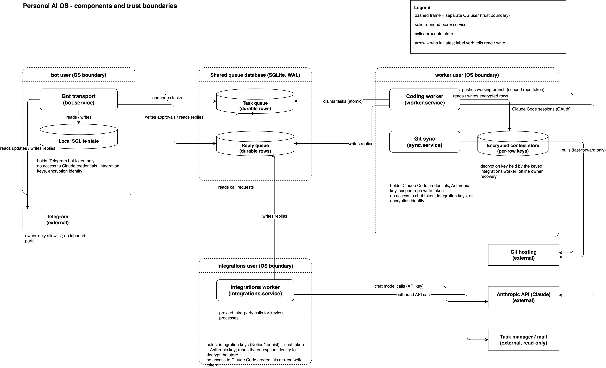
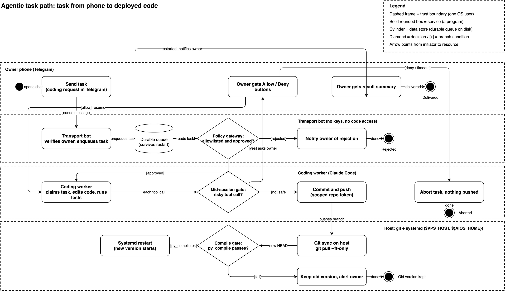
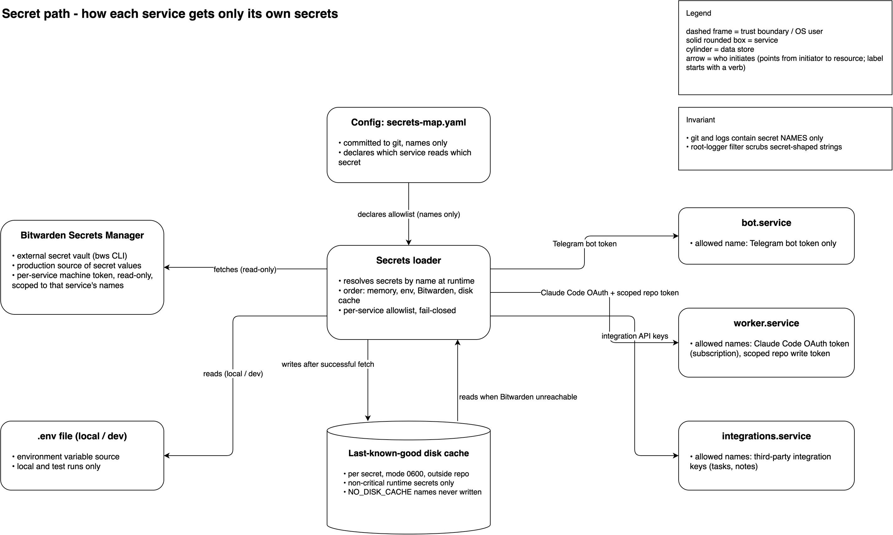
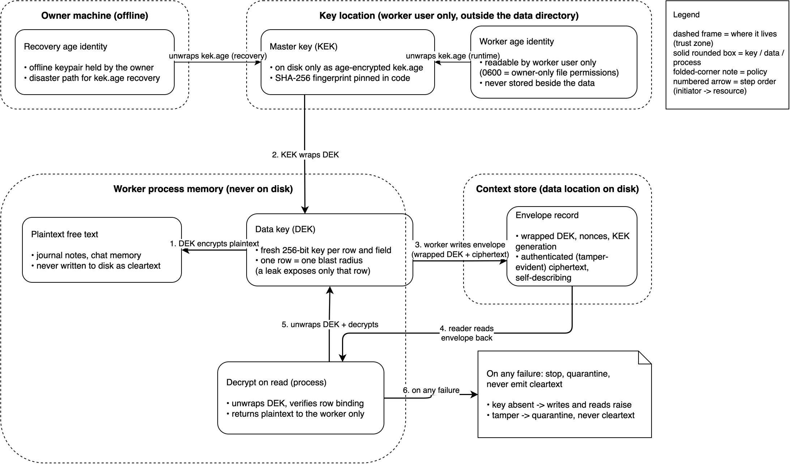

# Diagrams — how to read them

Four diagrams, one idea each. Terms used across them are in the glossary below.

## components-trust-boundaries

**What it shows:** every running part of the system and, more importantly, what each
part is *not allowed* to see. Dashed frames are OS-user boundaries: each service runs
as its own Linux user, and the bold "NO ACCESS" note inside each frame lists the keys
that user cannot read even if fully compromised. The shared queue database is the only
place two users touch the same file. External services (Telegram, Git hosting,
Anthropic API, and task/notes integrations such as Todoist and Notion) sit outside
the frames.

## agentic-task-path

**What it shows:** the life of one coding task, from a Telegram message on a phone to
the bot restarting itself on the new code. Diamonds are gates: a policy check before
work starts, a mid-session owner Allow/Deny prompt when the agent wants to do something
risky, and a compile check before the new version is allowed to boot. All three gates
ship enabled by default: the Allow/Deny gate is fail-closed (no answer in 5 minutes =
deny) with `AIOS_TOOL_APPROVALS=0` as the kill-switch (see the repo README §2/§4).

## secret-path

**What it shows:** how secret values reach each service. The secrets loader resolves
names at runtime against a per-service allowlist, so every service receives only the
few secrets it is entitled to. Production pulls from Bitwarden Secrets Manager with a
last-known-good disk cache as fallback; local runs use a plain `.env` file. Secret
values never appear in code, logs, or git.

## encryption-envelope

**What it shows:** how personal free text is stored encrypted at rest. Each record
gets its own fresh data key (DEK); the data key is wrapped by a master key (KEK),
which itself lives on disk only age-encrypted. The private age identity is readable by
the worker user only and is never stored beside the data. At-rest encryption is gated by
`AIOS_CONTEXT_ENCRYPTION`: **on in the production deployment** (every domain that stores personal
free text writes encrypted); code default `0` so the tree imports and the test suite runs without
provisioning production keys, and this diagram does not apply while the flag is off. The keyed
worker's queue applier is fail-closed: with the flag off it refuses store operations (rather than
serving them keyless), and with the flag on but the key absent, reads and writes fail closed — the
system never falls back to plaintext on the queue path.

## Glossary

| Term | Meaning |
|---|---|
| `bot.service`, `worker.service`, `integrations.service`, `sync.service` | the four systemd units — services the OS starts, supervises and restarts |
| transport | the process that only moves messages in and out (Telegram polling, owner check, reply delivery) — it holds no intelligence and no sensitive keys |
| `0700` / `0600` | Unix file permissions: directory/file readable by the owning user only |
| durable rows | queue items stored as database rows, not in memory — they survive crashes and restarts |
| WAL | SQLite write-ahead-log mode — lets one process write while others read safely |
| OS boundary / trust boundary | a separate Linux user account; the kernel enforces what it can and cannot read |
| AEAD | authenticated encryption — ciphertext that detects tampering on decrypt |
| DEK / KEK | data-encryption key (one per record) / key-encryption key (wraps the DEKs) |
| age identity | keypair of the [age](https://age-encryption.org) file-encryption tool |
| fail-closed | on any key/decrypt problem the operation raises an error instead of degrading to plaintext |
| scoped repo token | git credential that can push only to the allowed repository |
